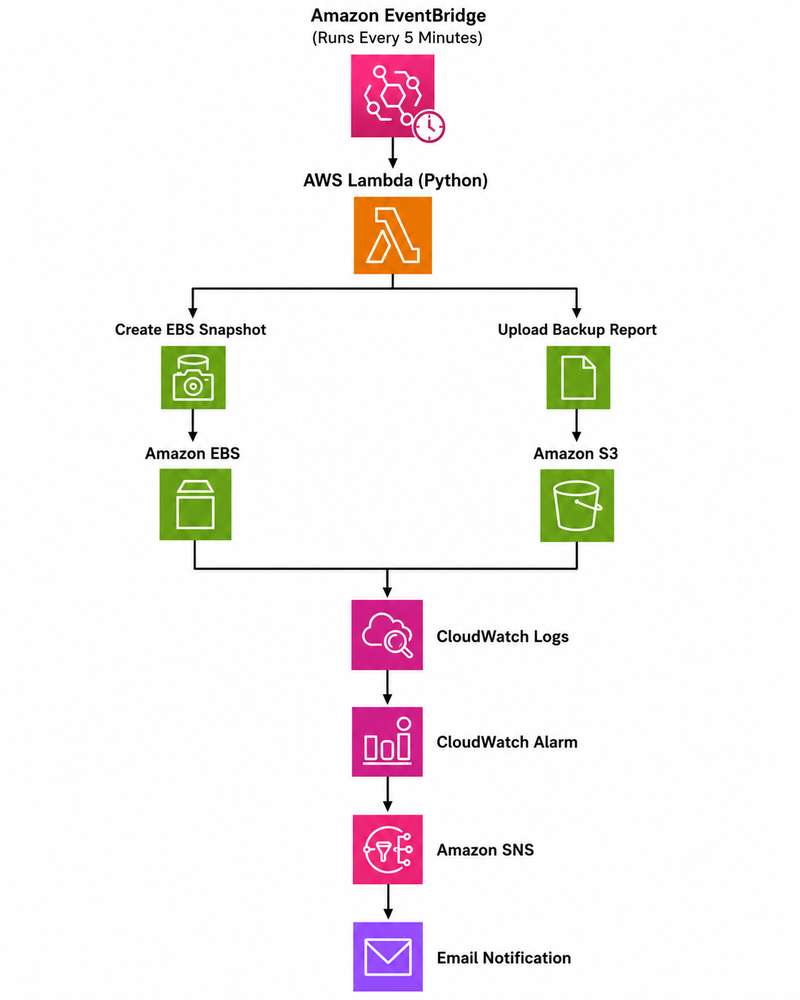
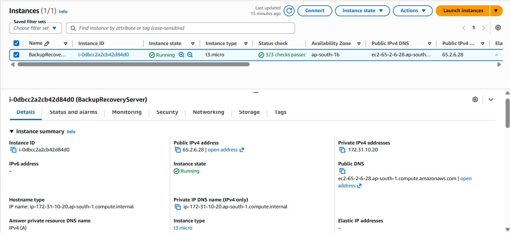
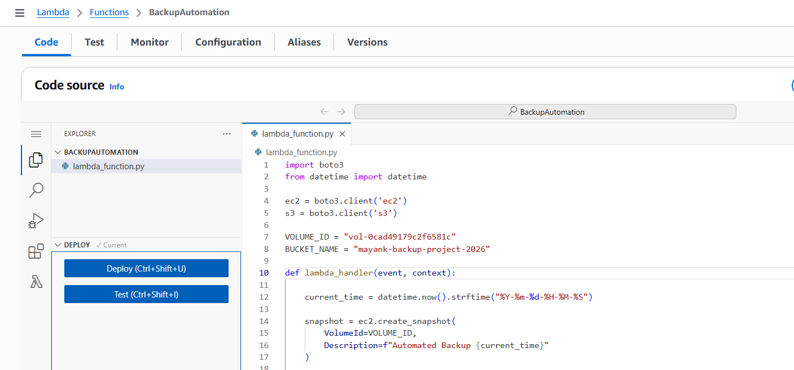
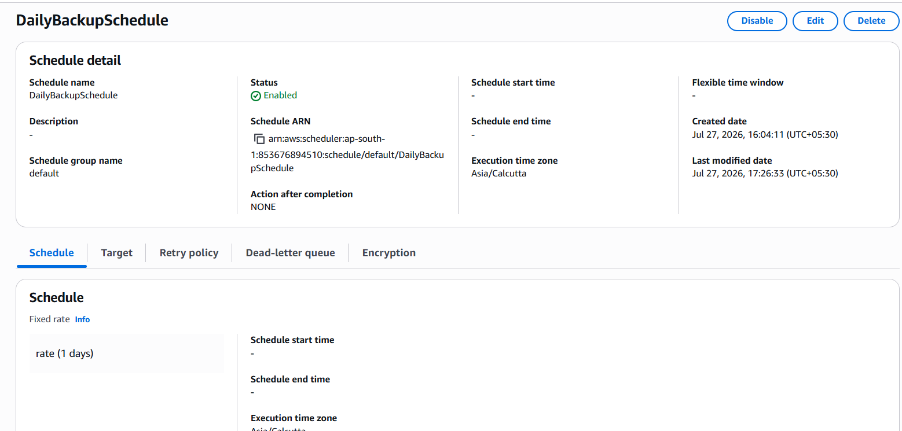
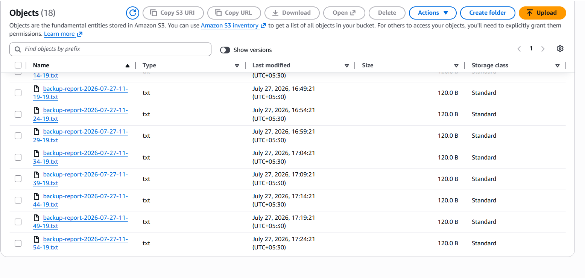
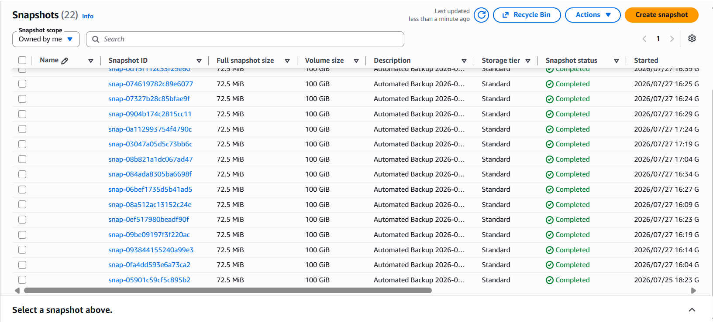
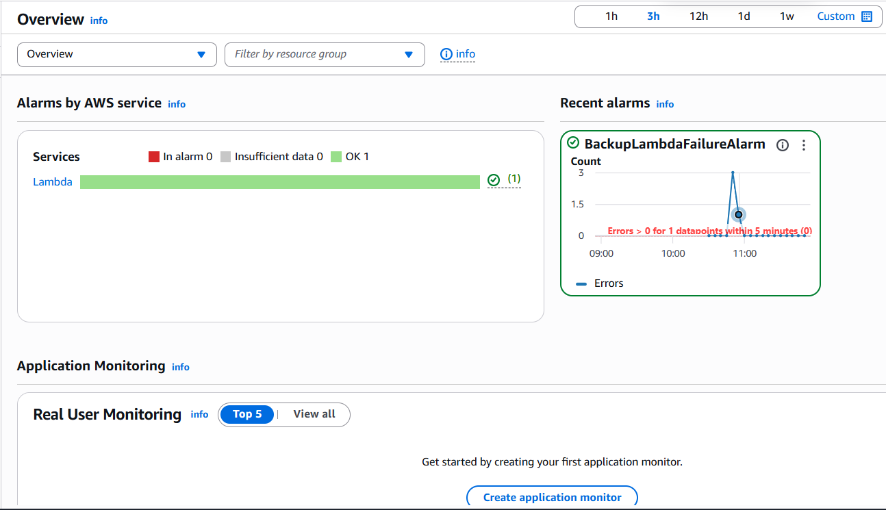
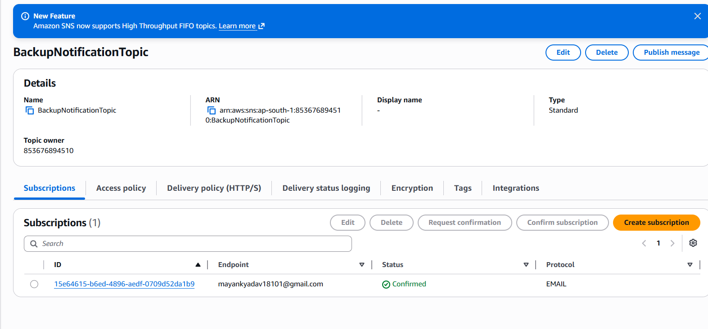

# AWS Backup & Disaster Recovery Automation

## Project Overview

AWS Backup & Disaster Recovery Automation is a serverless cloud solution designed to automate the backup process of an Amazon EC2 instance. The project periodically creates Amazon EBS snapshots, stores backup reports in Amazon S3, records execution logs in Amazon CloudWatch, and sends email notifications using Amazon SNS.

The automation is achieved using AWS Lambda and Amazon EventBridge Scheduler, eliminating manual intervention while improving reliability and disaster recovery readiness.

---

# Abstract

Modern organizations rely heavily on cloud infrastructure to host critical applications and data. Manual backup processes are time-consuming, error-prone, and difficult to scale. This project implements an automated backup and disaster recovery solution using Amazon Web Services (AWS).

The solution schedules backup operations using Amazon EventBridge Scheduler, executes backup logic through AWS Lambda, creates Amazon EBS snapshots for persistent storage, uploads backup reports to Amazon S3, records execution logs in Amazon CloudWatch, and notifies administrators through Amazon SNS.

The project demonstrates how multiple AWS services can be integrated to build a reliable, scalable, and serverless backup system.

---

# Problem Statement

Organizations require reliable backup mechanisms to protect their infrastructure against accidental deletion, hardware failures, ransomware attacks, and natural disasters.

Traditional backup methods require manual intervention, increasing the chances of human error and delayed recovery.

An automated backup solution is required that:

- Performs backups automatically.
- Minimizes manual effort.
- Maintains backup reports.
- Monitors execution status.
- Sends notifications after every backup.

---

# Objectives

- Automate EC2 backup operations.
- Create EBS snapshots periodically.
- Store backup reports securely in Amazon S3.
- Log backup execution using CloudWatch.
- Notify administrators through Amazon SNS.
- Demonstrate disaster recovery automation using AWS serverless services.

---

# AWS Services Used

| AWS Service | Purpose |
|-------------|---------|
| Amazon EC2 | Hosts application and data |
| Amazon EBS | Persistent block storage |
| AWS Lambda | Executes backup automation |
| Amazon EventBridge Scheduler | Triggers Lambda automatically |
| Amazon S3 | Stores backup reports |
| Amazon CloudWatch | Logs and monitoring |
| Amazon SNS | Email notifications |
| AWS IAM | Secure permissions management |

---

# Programming Language

- Python 3.x

---

# Project Architecture

Insert the architecture diagram below.



---

# System Workflow

The backup automation follows the sequence below.

1. Amazon EventBridge Scheduler triggers the Lambda function every five minutes.
2. AWS Lambda starts the backup process.
3. Lambda creates an Amazon EBS snapshot of the EC2 volume.
4. Lambda generates a backup report.
5. The backup report is uploaded to Amazon S3.
6. Execution details are stored in Amazon CloudWatch Logs.
7. Amazon SNS sends an email notification indicating backup completion.

---

# Project Implementation

## Step 1 – Launch EC2 Instance

An Amazon EC2 instance was created to simulate a production server. Sample employee data was stored on the instance to demonstrate backup operations.

---

## Step 2 – Configure Amazon EBS

An additional Amazon EBS volume was attached to the EC2 instance.

The volume was formatted, mounted, and used as backup storage.

---

## Step 3 – Create Amazon S3 Bucket

An S3 bucket was created to securely store backup reports generated during every backup execution.

Bucket Name:

```
mayank-backup-project-2026
```

---

## Step 4 – Create IAM Role

An IAM role was created for AWS Lambda with permissions to access:

- Amazon EC2
- Amazon EBS
- Amazon S3
- Amazon CloudWatch
- Amazon SNS

This role allows Lambda to perform backup operations securely.

---

## Step 5 – Develop AWS Lambda Function

A Python Lambda function was developed to automate the following tasks:

- Create EBS snapshot
- Generate backup report
- Upload report to S3
- Write execution logs
- Send SNS notification

---

## Step 6 – Configure EventBridge Scheduler

Amazon EventBridge Scheduler was configured to execute the Lambda function automatically every five minutes.

This eliminates manual execution.

---

## Step 7 – Configure CloudWatch

Amazon CloudWatch Logs records:

- Lambda execution
- Snapshot creation
- Upload status
- Error messages

CloudWatch enables monitoring and troubleshooting.

---

## Step 8 – Configure Amazon SNS

Amazon SNS sends email notifications whenever the backup process completes successfully.

This provides real-time monitoring.

---

# Testing

The following tests were performed.

| Test | Status |
|------|--------|
| EC2 Instance Running | Passed |
| EBS Volume Attached | Passed |
| Lambda Executed | Passed |
| Snapshot Created | Passed |
| Backup Report Uploaded | Passed |
| CloudWatch Logs Generated | Passed |
| SNS Email Received | Passed |
| EventBridge Schedule Triggered | Passed |

---

# Screenshots

## EC2 Instance



---

## Lambda Function



---

## EventBridge Scheduler



---

## Amazon S3



---

## Snapshot



---

## CloudWatch Logs



---

## Amazon SNS



---

# Advantages

- Fully automated backup process
- Serverless architecture
- Minimal operational effort
- Highly scalable
- Reliable monitoring
- Secure backup storage
- Fast disaster recovery preparation
- Easy maintenance

---

# Limitations

- Supports a single AWS Region.
- Restore operation is manual.
- Basic backup reporting.
- No automated snapshot lifecycle policy.

---

# Future Scope

- Cross-region disaster recovery
- Automated restore process
- AWS Backup integration
- Snapshot lifecycle management
- Infrastructure as Code using Terraform
- CloudFormation deployment
- Backup dashboard using Amazon CloudWatch
- Backup encryption using AWS KMS

---

# Conclusion

The AWS Backup & Disaster Recovery Automation project successfully demonstrates the implementation of an automated cloud backup solution using AWS serverless services. The integration of Amazon EC2, Amazon EBS, AWS Lambda, Amazon EventBridge Scheduler, Amazon S3, Amazon CloudWatch, and Amazon SNS provides an efficient and reliable backup mechanism that minimizes manual intervention while improving disaster recovery readiness.

The project highlights practical cloud automation techniques and demonstrates how multiple AWS services can be combined to build scalable, reliable, and cost-effective infrastructure management solutions.

---

# References

1. AWS Documentation
2. Amazon EC2 Documentation
3. AWS Lambda Documentation
4. Amazon EventBridge Documentation
5. Amazon S3 Documentation
6. Amazon CloudWatch Documentation
7. Amazon SNS Documentation
8. AWS IAM Documentation

---

# Author

**Mayank Yadav**

B.Tech Electronics & Telecommunication Engineering

Symbiosis Institute of Technology, Pune

GitHub:
https://github.com/Mayankyadav-018

Project:
https://github.com/Mayankyadav-018/AWS-Backup-Disaster-Recovery-Automation